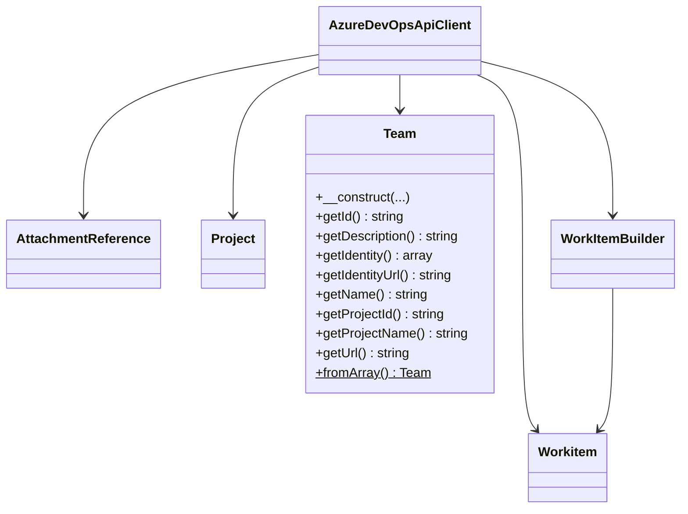

```mermaid
classDiagram
    class AzureDevOpsApiClient
    class AttachmentReference
    class Project
    class Team {
        +__construct(...)
        +getId() string
        +getDescription() string
        +getIdentity() array
        +getIdentityUrl() string
        +getName() string
        +getProjectId() string
        +getProjectName() string
        +getUrl() string
        +fromArray()$ Team
    }
    class WorkItemBuilder
    class Workitem
    AzureDevOpsApiClient --> AttachmentReference
    AzureDevOpsApiClient --> Project
    AzureDevOpsApiClient --> Team
    AzureDevOpsApiClient --> WorkItemBuilder
    AzureDevOpsApiClient --> Workitem
    WorkItemBuilder --> Workitem
```